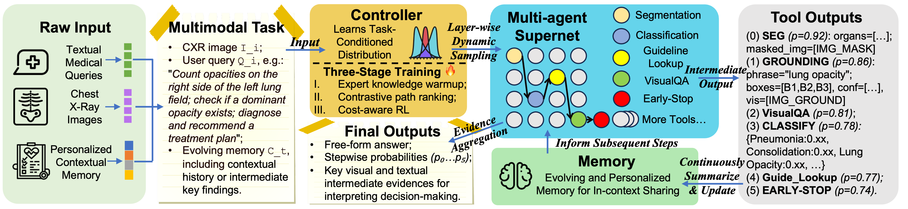

<div align="center">

# 🏥 PASS: Probabilistic Agentic Supernet Sampling for Interpretable and Adaptive Chest X-Ray Reasoning

**Interpretable and Adaptive Chest X-Ray Reasoning**

[](https://arxiv.org/abs/2508.10501)
[](LICENSE)
[](https://www.python.org/)
[](https://doi.org/10.48550/arXiv.2508.10501)

[**Paper**](https://arxiv.org/abs/2508.10501) | [**Code**](https://github.com/yourusername/PASS) | [**Data**](#) | [**Demo**](#)

</div>

---

## 📖 Table of Contents

- [Overview](#overview)
- [Framework Architecture](#framework-architecture)
- [Algorithm](#algorithm)
  - [Training Procedure](#training-procedure)
  - [Inference Procedure](#inference-procedure)
- [Performance Results](#performance-results)
- [Installation](#installation)
- [Quick Start](#quick-start)
- [Citation](#citation)
- [Authors](#authors)
- [License](#license)
- [Acknowledgments](#acknowledgments)

---

## 🌟 Overview

**PASS** (Probabilistic Agentic Supernet Sampling) is the first multimodal framework that addresses critical challenges in Chest X-Ray (CXR) reasoning through probabilistic agentic workflows. 

### 🎯 Core Contributions

- 🧠 **Adaptive Decision-Making**: Dynamic tool selection based on case complexity via task-conditioned distribution over the agentic supernet
- 🎯 **Interpretable Workflows**: Probability-annotated decision paths for post-hoc audits and enhanced medical AI safety
- ⚡ **Efficient Inference**: Cost-aware reinforcement learning with dynamic early exit for optimal resource utilization
- 🏆 **State-of-the-Art Performance**: Superior results across multiple radiology VQA benchmarks (CAB-E, CAB-Standard, SLAKE)
- 🔄 **Personalized Memory**: Continuous compression of salient findings into an evolving memory buffer
- 🆕 **CAB-E Benchmark**: First comprehensive benchmark for multi-step, safety-critical, free-form CXR reasoning

> **Key Innovation**: PASS adaptively samples agentic workflows over a multi-tool graph, yielding decision paths annotated with interpretable probabilities. Unlike existing black-box agentic systems, PASS offers transparent reasoning steps that enhance trust and safety in medical decision-making, while optimizing a Pareto frontier balancing performance and computational cost.

📄 **Paper**: [arXiv:2508.10501](https://arxiv.org/abs/2508.10501) | 📖 **PDF**: [Download](https://arxiv.org/pdf/2508.10501)

---

## 🏗️ Framework Architecture

<div align="center">
  
  <p><em>Figure 1: The PASS framework architecture showing the complete workflow from input to diagnosis.</em></p>
</div>

The PASS framework consists of three main components:

1. **Supernet $\mathcal{G}$**: A multi-tool graph containing specialized medical reasoning tools (e.g., visual grounding, region analysis, medical knowledge retrieval)
2. **Policy Network $\pi_\theta$**: Learns task-conditioned distribution to adaptively select tools at each supernet layer, providing probability-annotated trajectories
3. **Answer Generator $p_\phi$**: Produces final diagnosis based on the complete reasoning trajectory and personalized memory

### Key Features

- ✅ **First multimodal agentic framework** for CXR reasoning with interpretable probability annotations
- ✅ **Novel three-stage training**: Expert warm-up → Contrastive path-ranking → Cost-aware RL
- ✅ **Dynamic early exit** mechanism for computational efficiency
- ✅ **Safety-critical design** with transparent decision paths for medical auditing
- ✅ **CAB-E benchmark**: New comprehensive evaluation for multi-step CXR reasoning

---

## 🔬 Algorithm

### 📚 Training Procedure

<details>
<summary><b>Click to expand training details</b></summary>

#### Requirements

| Component | Description |
|-----------|-------------|
| $\mathcal{D}_{\mathrm{exp}}$ | Expert demonstrations |
| $\mathcal{D}_{\mathrm{ul}}$ | Unlabeled data |
| $\mathcal{G}$ | Supernet of reasoning tools |
| $\psi$ | State encoder |
| $\pi_\theta$ | Policy network |
| $p_\phi$ | Answer generator |
| $R_h$ | Heuristic reward function |
| $\lambda$ | Cost weights |
| $\gamma$ | Entropy weight |

#### Three-Phase Training Strategy

##### 🔵 Phase I: Expert Knowledge Warm-up

Initialize the policy with expert demonstrations to establish a strong baseline.

- **For** each expert demonstration $(s, a^\star) \in \mathcal{D}_{\mathrm{exp}}$:
  - Update policy parameters: 
  
    $$\theta \leftarrow \theta - \eta_1 \nabla_\theta \bigl( -\log \pi_\theta(a^\star \mid s) \bigr)$$

##### 🟢 Phase II: Heuristic-Guided Path Ranking

Refine the policy using contrastive preference ranking on unlabeled data.

- **For** each unlabeled sample $(q, I, C) \in \mathcal{D}_{\mathrm{ul}}$:
  - Sample K trajectories: $\{\tau_k\}_{k=1}^{K} \sim \pi_\theta(\cdot \mid q, I, C)$
  - Compute trajectory probability:
  
    $$p(\tau_k) \leftarrow \frac{\exp(R_h(\tau_k)/\alpha_{\mathrm{cpr}})}{\sum_{j=1}^{K} \exp(R_h(\tau_j)/\alpha_{\mathrm{cpr}})}$$
  
  - Compute contrastive preference ranking loss:
  
    $$\mathcal{L}_{\text{CPR}} \leftarrow - \sum_{k=1}^{K} p(\tau_k) \log \pi_\theta(\tau_k)$$
  
  - Update $\theta$ using $\nabla_\theta \mathcal{L}_{\text{CPR}}$

##### 🟡 Phase III: Cost-aware Reinforcement Learning

Fine-tune the policy with task performance and cost considerations.

- **For** $n = 1$ **to** $N_{\mathrm{RL}}$:
  - Sample trajectory from policy: $\tau \sim \pi_\theta(\cdot \mid q, I, C) \in \mathcal{D}_{\mathrm{ul}}$
  - Generate answer: $\hat{a} \sim p_\phi(\cdot \mid \tau, q, I, C)$
  - Compute reward: $R(\tau) \leftarrow \mathcal{U}(\hat{a}, a^\star) - \lambda \mathcal{L}(\tau) - \gamma H(\hat{a})$
  - Policy gradient update: $\theta \leftarrow \theta + \eta_3 R(\tau) \nabla_\theta \log \pi_\theta(\tau)$

</details>

---

### 🔍 Inference Procedure

<details>
<summary><b>Click to expand inference details</b></summary>

#### Requirements

| Component | Description |
|-----------|-------------|
| $\pi_\theta$ | Trained policy network |
| $p_\phi$ | Trained answer generator |
| $\mathcal{S}$ | Summarizer |
| $\psi$ | State encoder |
| $\mathcal{G}$ | Supernet |
| $T_{\max}$ | Maximum steps |

#### Inference Algorithm

1. **Initialize**: $M, \tau \leftarrow \emptyset, []$ _(Initialize memory and trajectory)_

2. **For** $t = 1$ **to** $T_{\max}$:
   - Sample action from policy: $a_t \sim \pi_\theta(\cdot \mid \psi(q, I, C, M))$
   - **If** $a_t = \text{EarlyExit}$:
     - **break**
   - Execute tool: $\rho_t \leftarrow \text{ExecuteTool}(a_t)$
   - Update memory: $M \leftarrow M \cup \mathcal{S}(\rho_t)$
   - Record trajectory: $\tau \leftarrow \tau \cdot a_t$

3. **Generate final answer**: $\hat{a} \sim p_\phi(\cdot \mid q, I, C, \tau)$

4. **Return**: $(\hat{a}, \tau)$ _(Return final answer and full workflow)_

</details>

---

## 📊 Performance Results

### 🏆 Comparison on Three Radiology VQA Benchmarks

Our method achieves **state-of-the-art** performance across multiple benchmarks. Results are reported as mean ± standard deviation. **Bold** indicates best results, *italic* indicates runner-up results.

> 📌 **Note**: We introduce **CAB-E**, a comprehensive benchmark for multi-step, safety-critical, free-form CXR reasoning to facilitate rigorous evaluation of agentic medical AI systems.

#### CAB-E Dataset

<div align="center">

| Model | Acc.↑ | LLM-J.↑ | BLEU↑ | METEOR↑ | ROUGE-L↑ | Sim.↑ | Lat.↓ |
|:------|:-----:|:-------:|:-----:|:-------:|:--------:|:-----:|:-----:|
| GPT-4o (zero-shot) | 60.06±0.01 | 45.29±0.07 | 4.09±0.03 | 25.63±0.02 | 25.84±0.01 | 79.03±0.01 | 18.37 |
| └─ CoT | 59.18±0.01 | 39.43±0.06 | 3.83±0.03 | 23.93±0.02 | 25.25±0.01 | 77.62±0.01 | 20.30 |
| └─ ComplexCoT | 63.26±0.01 | 41.06±0.06 | 4.22±0.04 | 25.14±0.02 | 25.12±0.02 | 78.03±0.01 | 22.17 |
| └─ SC (CoT×5) | 79.59±0.08 | 54.13±0.07 | 5.34±0.01 | 31.22±0.02 | 25.83±0.01 | 76.14±0.03 | *14.55* |
| GPT-4o (finetuned) | 81.82±0.06 | 75.76±0.02 | **18.20**±0.01 | *32.92*±0.01 | 44.49±0.02 | 88.19±0.01 | 14.99 |
| o3-mini (+visual tool) | 73.73±0.01 | 68.08±0.04 | 4.43±0.01 | 33.09±0.01 | 24.52±0.01 | 80.21±0.02 | 41.91 |
| CheXagent | 83.67±0.01 | 69.47±0.01 | 2.71±0.01 | 14.68±0.01 | 20.78±0.01 | 82.52±0.01 | **2.20** |
| LLaVA-Med | 86.96±0.05 | *82.65*±0.04 | 8.28±0.01 | 29.96±0.01 | *31.26*±0.01 | **91.00**±0.01 | 21.43 |
| MedRAX | *89.54*±0.02 | 76.94±0.01 | 5.56±0.02 | 32.84±0.05 | 27.11±0.02 | 88.69±0.02 | 17.44 |
| **PASS (Ours)** | **91.22**±0.12 | **84.28**±0.10 | *8.51*±0.05 | **33.21**±0.05 | **31.49**±0.09 | *90.16*±0.04 | 22.06 |

</div>

#### CAB-Standard Dataset

<div align="center">

| Model | Acc.↑ | Lat.↓ |
|:------|:-----:|:-----:|
| GPT-4o (zero-shot) | 45.45±0.02 | *3.10* |
| └─ CoT | 50.51±0.02 | 3.34 |
| └─ ComplexCoT | 44.44±0.01 | 3.41 |
| └─ SC (CoT×5) | 43.43±0.02 | 10.35 |
| GPT-4o (finetuned) | 62.83±0.01 | 3.79 |
| o3-mini (+visual tool) | 50.51±0.01 | 26.18 |
| CheXagent | 62.63±0.03 | **0.40** |
| LLaVA-Med | 53.23±0.01 | 7.79 |
| MedRAX | *63.49*±0.02 | 7.39 |
| **PASS (Ours)** | **66.10**±0.03 | 8.05 |

</div>

#### SLAKE Dataset

<div align="center">

| Model | AUROC↑ | Lat.↓ |
|:------|:------:|:-----:|
| GPT-4o (zero-shot) | 37.25±0.03 | *2.25* |
| └─ CoT | 38.78±0.02 | 2.43 |
| └─ ComplexCoT | 42.86±0.03 | 2.57 |
| └─ SC (CoT×5) | 44.88±0.02 | 7.83 |
| GPT-4o (finetuned) | 81.82±0.01 | 3.36 |
| o3-mini (+visual tool) | 54.55±0.01 | 11.63 |
| CheXagent | *78.80*±0.01 | **0.65** |
| LLaVA-Med | 60.60±0.01 | 10.14 |
| MedRAX | 74.90±0.02 | 10.47 |
| **PASS (Ours)** | **87.81**±0.03 | 7.52 |

</div>

<details>
<summary><b>📈 Metrics Explanation</b></summary>

| Metric | Description | Direction |
|--------|-------------|-----------|
| **Acc.** | Accuracy score | ↑ Higher is better |
| **LLM-J.** | LLM Judge score | ↑ Higher is better |
| **BLEU** | BLEU score for text quality | ↑ Higher is better |
| **METEOR** | METEOR score for semantic similarity | ↑ Higher is better |
| **ROUGE-L** | ROUGE-L score for text overlap | ↑ Higher is better |
| **Sim.** | Semantic similarity score | ↑ Higher is better |
| **Lat.** | Latency in seconds | ↓ Lower is better |
| **AUROC** | Area Under the ROC Curve | ↑ Higher is better |

</details>

---

## 🚀 Installation

```bash
# Clone the repository
git clone https://github.com/yourusername/PASS.git
cd PASS

# Create a virtual environment
python -m venv venv
source venv/bin/activate  # On Windows: venv\Scripts\activate

# Install dependencies
pip install -r requirements.txt
```

---

## 💡 Quick Start

```python
# Coming soon...
```

---

## 📝 Citation

If you find our work helpful, please consider citing our paper:

**PASS: Probabilistic Agentic Supernet Sampling for Interpretable and Adaptive Chest X-Ray Reasoning**  
*Yushi Feng, Junye Du, Yingying Hong, Qifan Wang, Lequan Yu*  
arXiv preprint arXiv:2508.10501, 2025  
🔗 [Paper Link](https://arxiv.org/abs/2508.10501) | 📖 [PDF](https://arxiv.org/pdf/2508.10501)

```bibtex
@misc{feng2025pass,
      title={PASS: Probabilistic Agentic Supernet Sampling for Interpretable and Adaptive Chest X-Ray Reasoning}, 
      author={Yushi Feng and Junye Du and Yingying Hong and Qifan Wang and Lequan Yu},
      year={2025},
      eprint={2508.10501},
      archivePrefix={arXiv},
      primaryClass={cs.AI},
      url={https://arxiv.org/abs/2508.10501}, 
}
```
## 📄 License

This project is released under the MIT License. See [LICENSE](LICENSE) for details.

---

## 🙏 Acknowledgments

This work was supported in part by the Research Grants
Council of Hong Kong (27206123, 17200125, C5055-24G,
and T45-401/22-N), the Hong Kong Innovation and Technology Fund (GHP/318/22GD), the National Natural Science Foundation of China (No. 62201483), and Guangdong
Natural Science Fund (No. 2024A1515011875).

---

<div align="center">
  
**⭐ If you find this project useful, please consider giving it a star! ⭐**

Made with ❤️ by the PASS Team

</div>
